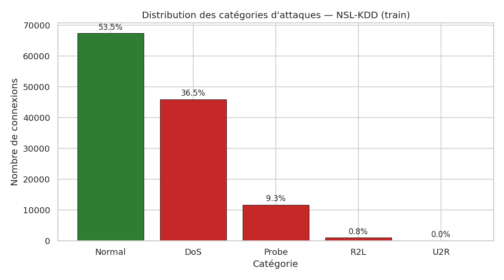
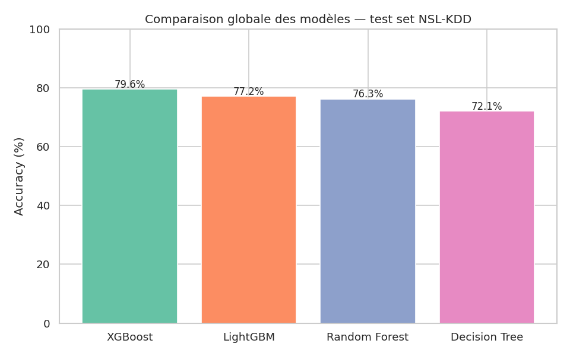
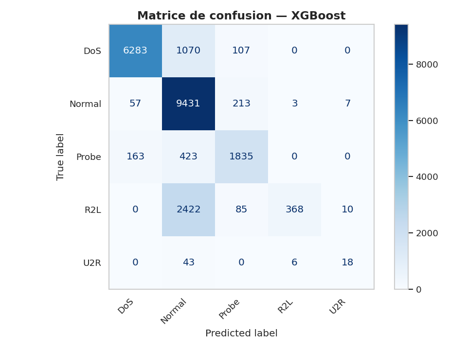
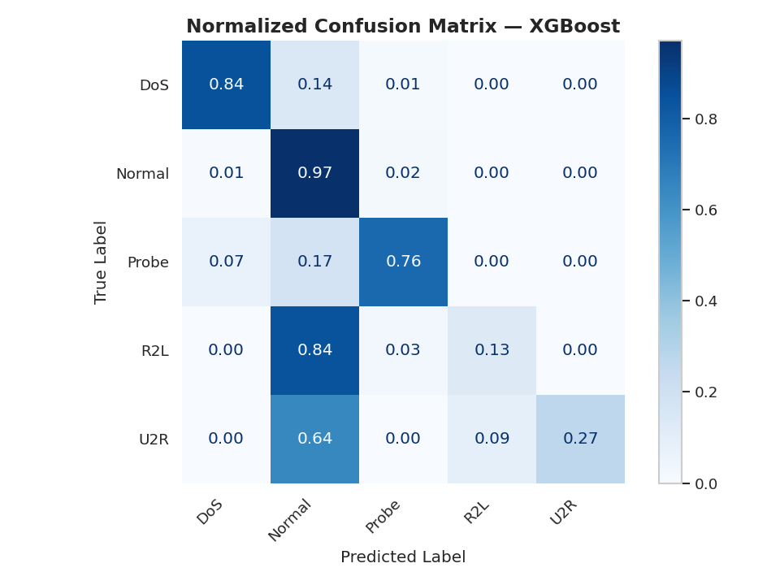
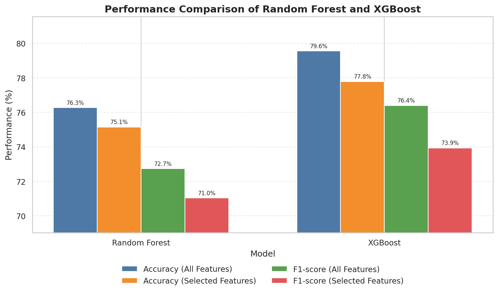
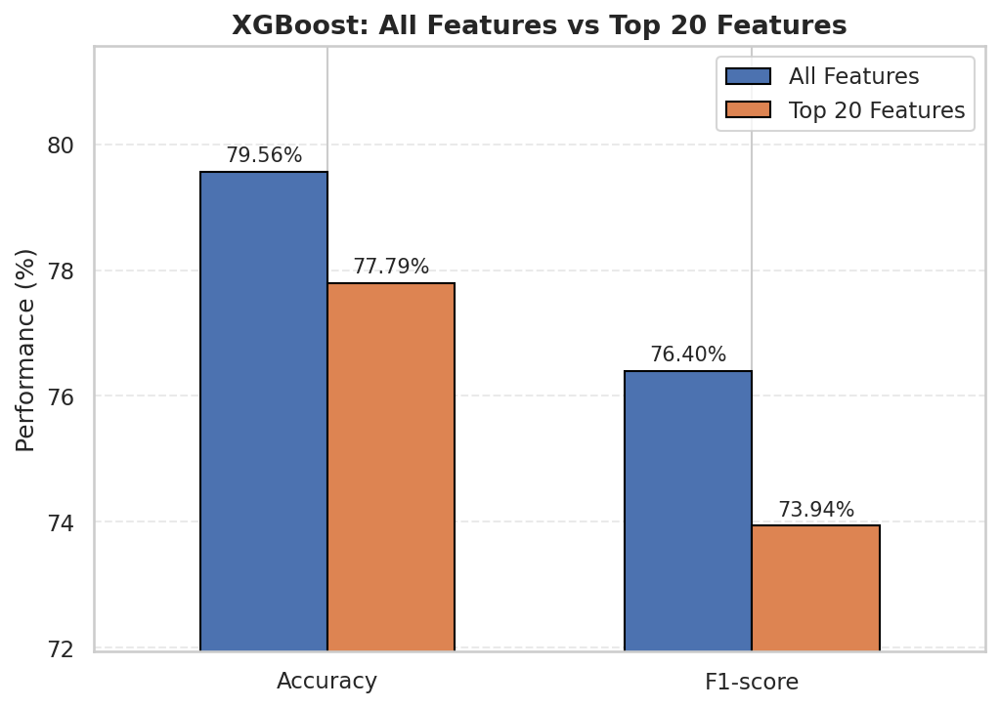

# Network Intrusion Detection — NSL-KDD

Machine Learning models for network intrusion detection using the **NSL-KDD** dataset.

This project builds and compares several ML classifiers that automatically detect network
intrusions and classify them into 5 categories: **Normal, DoS, Probe, R2L, U2R**.

## Overview

- **Dataset:** NSL-KDD (improved version of KDD Cup 1999) — 125,972 training connections /
  22,544 test connections, 41 features + label.
- **Goal:** Classify network connections as normal or as one of 4 attack families
  (DoS, Probe, R2L, U2R).
- **Approach:** EDA → preprocessing (encoding, scaling) → class-imbalance handling
  (undersampling + SMOTE) → feature selection → model training & comparison → evaluation.
- **Best model:** XGBoost (combined with SMOTE) achieved the strongest overall results
  (~80% accuracy on the real, held-out test set), though rare attack classes
  (R2L, U2R) remain the hardest to detect.

## Project Structure

```
network-intrusion-detection-nsl-kdd/
│
├── data/                # Raw NSL-KDD dataset (KDDTrain+.txt, KDDTest+.txt)
├── notebooks/           # Main Jupyter notebook (full pipeline)
├── src/                 # Reserved for reusable scripts (future refactor)
├── results/             # Model outputs: confusion matrices, feature importance
├── images/              # EDA plots (distributions, correlations, boxplots...)
├── requirements.txt     # Python dependencies
└── README.md
```

## Dataset

The [NSL-KDD dataset](https://www.unb.ca/cic/datasets/nsl.html) is a cleaned-up version of the
original KDD Cup 1999 dataset (duplicate records removed, better class balance). Each
connection record has 41 features (protocol type, service, flag, byte counts, error rates...)
and is labeled as `normal` or one of 23 specific attack types, grouped here into 4 attack
categories:

| Category | Description |
|---|---|
| **DoS**   | Denial of Service — overwhelms a service to make it unavailable |
| **Probe** | Network scanning to gather information before an attack |
| **R2L**   | Remote to Local — unauthorized remote access to a local machine |
| **U2R**   | User to Root — privilege escalation to admin/root access |

## Exploratory Data Analysis

Class distribution, correlation heatmaps, feature boxplots, and categorical feature analysis
are available in [`images/`](./images). Example:



## Methodology

1. **Preprocessing** — Label encoding of categorical features (`protocol_type`, `service`,
   `flag`), handling of duplicates.
2. **Class imbalance** — Undersampling of majority classes (Normal, DoS) combined with
   **SMOTE** oversampling for rare classes (R2L, U2R, Probe).
3. **Feature selection** — Ranking features by importance (mutual information) to reduce
   noise and improve performance.
4. **Model training** — Multiple classifiers trained and compared (including XGBoost,
   LightGBM, and other scikit-learn models).
5. **Evaluation** — Classification report, confusion matrix, and global model comparison.

## Results

Models are trained on the resampled training set and evaluated on the **original,
untouched** `KDDTest+` file (no data leakage) — this is a realistic, honest evaluation.
Besides accuracy we also track precision, recall, F1-score, balanced accuracy, MCC,
and Cohen's kappa.



| Model | Accuracy | F1-score |
|---|---|---|
| **XGBoost** | **~80%** | **~76%** |
| LightGBM | ~77% | ~74% |
| Random Forest | ~76% | ~73% |
| Decision Tree | ~72% | ~69% |




- **Normal** and **DoS** are detected reliably.
- **R2L** recall is low: most R2L attacks in the test set belong to sub-types the
  model never saw during training — NSL-KDD is designed this way on purpose, to
  test generalization rather than memorization.
- **U2R** remains the hardest category to detect, since it has by far the fewest
  training samples (52 out of ~126,000).

### All features vs. Mutual-Information selected features

Random Forest and XGBoost were also compared using **all 41 features** vs. only
the **top 20 features** ranked by mutual information with the target:




| Model | Accuracy (all) | Accuracy (top 20) | F1-score (all) | F1-score (top 20) |
|---|---|---|---|---|
| Random Forest | ~76.3% | ~75.1% | ~72.7% | ~71.0% |
| XGBoost | ~79.6% | ~77.8% | ~76.4% | ~73.9% |

Reducing to the 20 most informative features keeps performance close to the full
feature set — a good simplicity/performance trade-off, especially useful for a
lighter, faster real-time deployment.

More result visuals (feature importance ranking) are in [`results/`](./results).

## Getting Started

```bash
# Clone the repo
git clone https://github.com/Houssaynimaryame/network-intrusion-detection-nsl-kdd.git
cd network-intrusion-detection-nsl-kdd

# Install dependencies
pip install -r requirements.txt

# Launch the notebook
jupyter notebook notebooks/NSL_KDD_Intrusion_Detection.ipynb
```

## Tech Stack

- Python (Pandas, NumPy)
- Scikit-learn
- XGBoost, LightGBM
- imbalanced-learn (SMOTE)
- Matplotlib, Seaborn

## Future Work

- Use more recent, representative datasets (CICIDS2017, UNSW-NB15).
- Explore Deep Learning models (LSTM, Autoencoder, CNN) for complex attack detection.
- Build a real-time intrusion detection pipeline.

## Author

- Maryame Houssayni


Project realized as part of the "Programmation avancée en Python" module.

## License

This project is for educational purposes.
